<div align="center">


<h1>Azure Virtual Desktop (AVD) Monitoring Pack</h1>

<p><strong>Deep Observability, User Experience Analytics & Real-Time Health Intelligence</strong></p>

[](https://devopstrio.co.uk/)
[](https://devopstrio.co.uk/)
[](https://devopstrio.co.uk/)
[](/apps/alert-engine)

</div>

---

## 🏛️ Executive Summary

The **AVD Monitoring Pack** is a flagship enterprise platform designed to provide the deep observability and real-time intelligence required to maintain high-performance Azure Virtual Desktop (AVD) environments. In large-scale desktop estates, visibility isn't just about whether a VM is "up"; it's about the speed of a user's login, the latency of their profile load, and the responsiveness of their applications.

This platform automates the collection, normalization, and analysis of telemetry from **Azure Monitor**, **Log Analytics**, **VM Insights**, and **FSLogix** performance counters. By applying advanced analytics and anomaly detection, it enables operations teams to shift from reactive firefighting to proactive management. The monitoring pack provides built-in executive dashboards, smart alerting rings, and automated remediation triggers that significantly reduce MTTR (Mean Time To Resolution) and enhance the global developer and workforce experience.

### Strategic Business Outcomes
- **Optimized User Experience**: Identify and resolve login latency and profile synchronization issues before users report them.
- **Enhanced Operational Visibility**: Multi-region, single-pane-of-glass view of the entire global AVD estate with real-time health heatmaps.
- **Predictive Capacity Management**: Leverage AI-driven forecasting to adjust host pool scaling before peak demand periods.
- **Reduced Downtime**: Detect and auto-remediate session host failures through correlated telemetry and intelligent alert orchestration.

---

## 🏗️ Technical Architecture Details

### 1. High-Level Monitoring Architecture
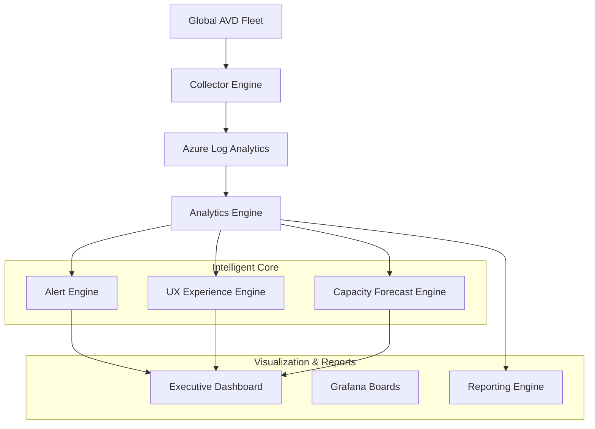

### 2. Telemetry Collection Workflow
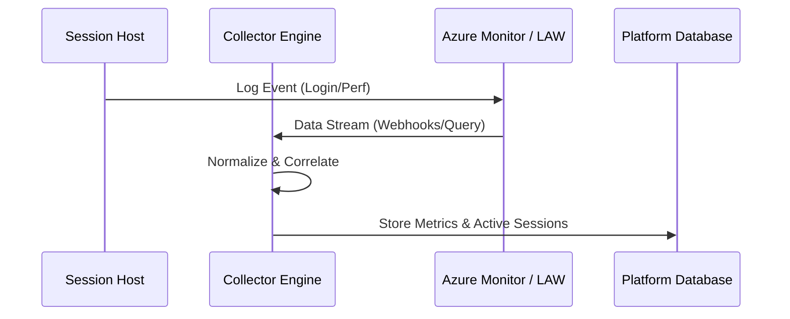

### 3. Alert Lifecycle & Auto-Remediation
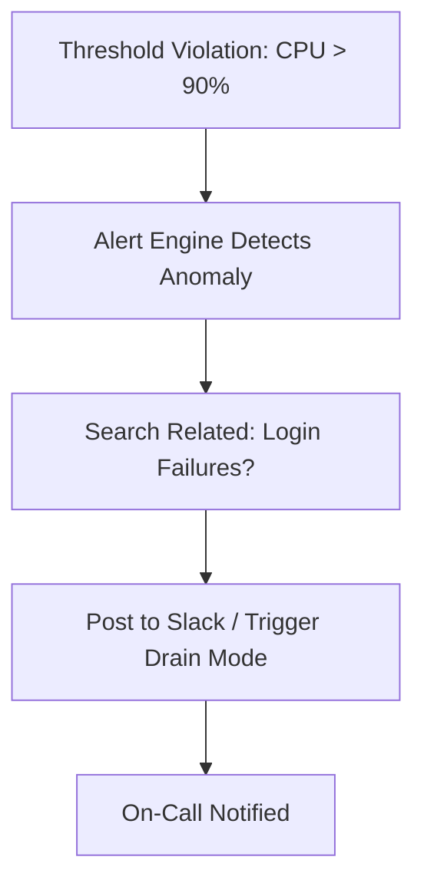

### 4. UX Analytics Flow
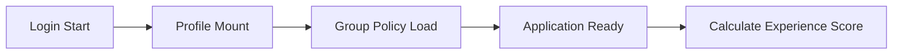

### 5. Capacity Forecast Workflow
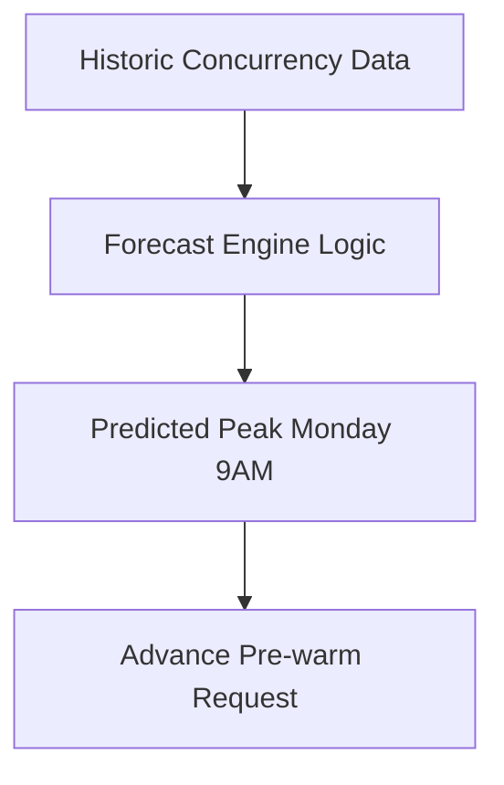

### 6. Security Trust Boundary
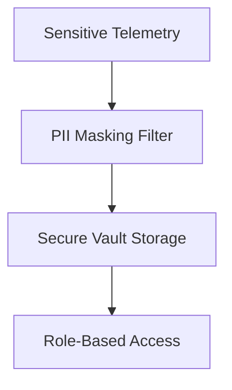

### 7. Global Monitoring Topology
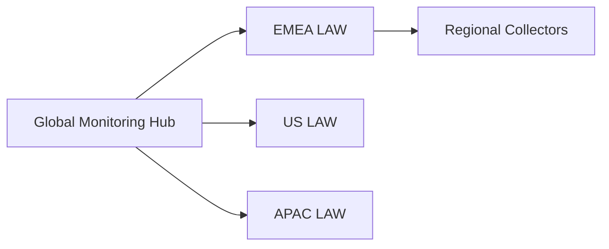

### 8. API Request Lifecycle
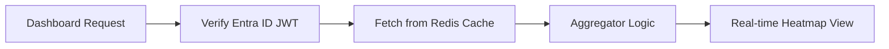

### 9. Multi-Tenant Tenancy Model
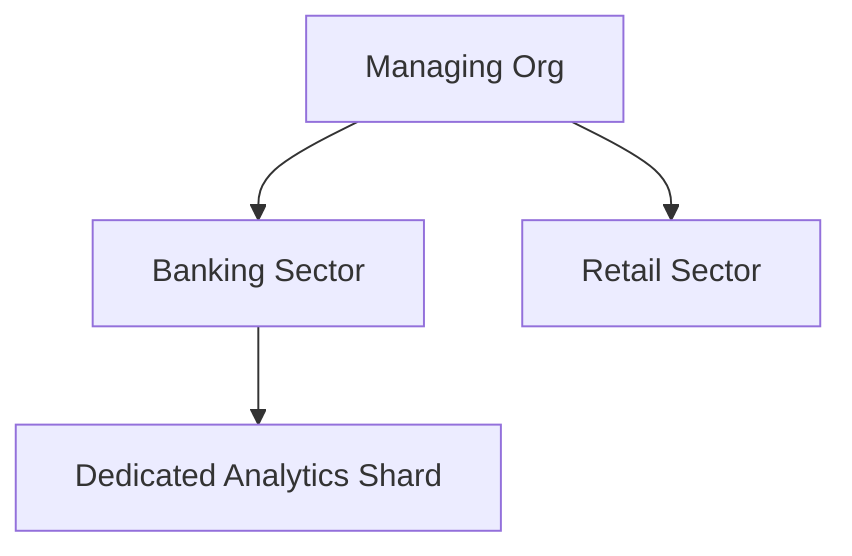

### 10. Real-time Monitoring Flow
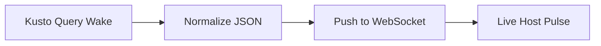

### 11. Disaster Recovery Topology
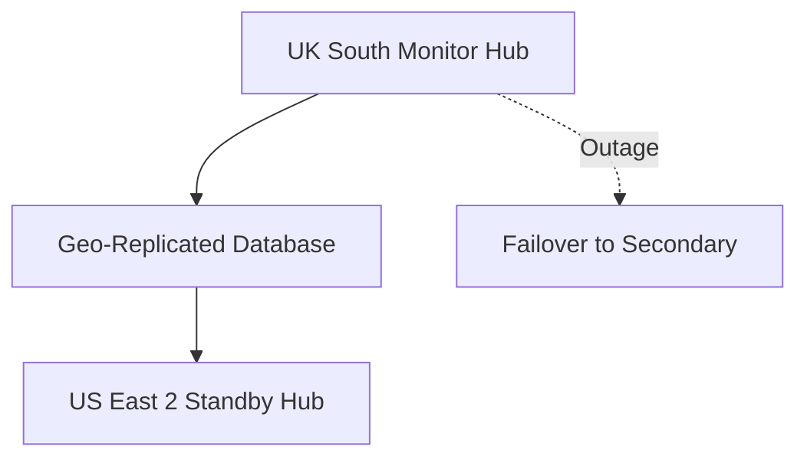

### 12. FSLogix Latency Workflow
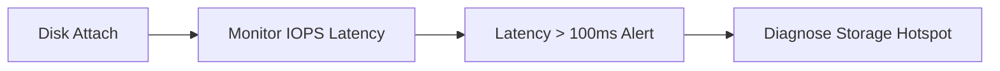

### 13. Identity Federation Model
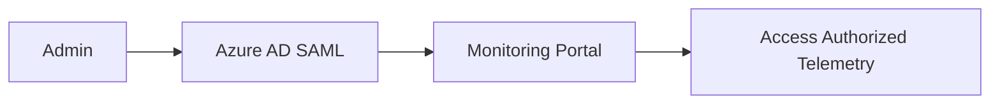

### 14. Cost Analytics Lifecycle
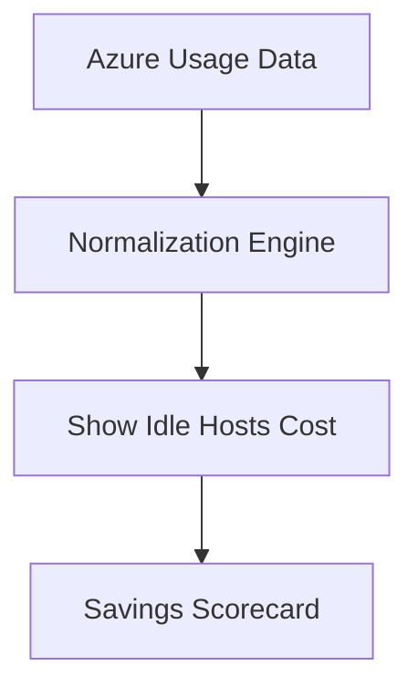

### 15. CI/CD Operations Pipeline
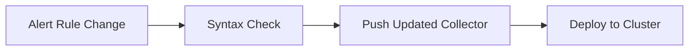

### 16. Executive Governance Workflow
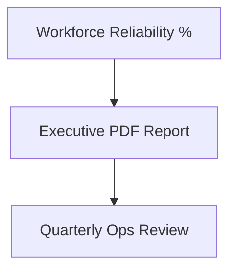

### 17. Noise Reduction Correlation Flow
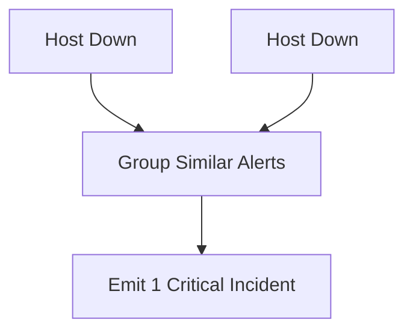

### 18. Global Region Topology
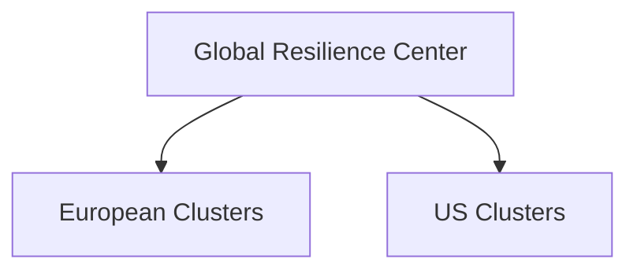

### 19. SLA Reporting Workflow
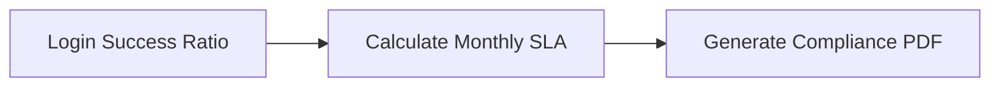

### 20. Auto-Remediation Workflow
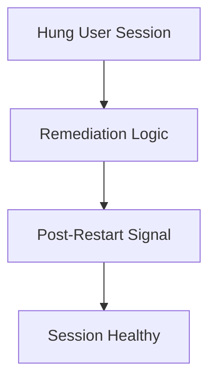

---

## 🚀 Experience The Platform

### Terraform Orchestration
```bash
cd terraform/environments/prd
terraform init
terraform apply -auto-approve
```

---
<sub>&copy; 2026 Devopstrio &mdash; Engineering the Future of Secure Digital Workspace Observability.</sub>
