<div align="center">


<h1>AVD Monitoring Pack</h1>

<p><strong>The Institutional-Grade Platform for Standardized Observability Foundations, User Experience Governance, and Multi-Cloud EUC Ecosystems.</strong></p>

[]()
[]()
[]()

<br/>

> **"Industrializing digital workplace observability to automate intelligence foundations."** 
> **AVD Monitoring Pack** is an enterprise-grade platform designed to provide a secure, measurable, and highly automated foundation for global virtual desktop operations. It orchestrates the complex lifecycle of observability—from automated telemetry collection and multi-cloud health reconciliation to high-throughput UX intelligence and unified EUC auditing.

</div>

---

## 🏛️ Executive Summary

Fragmented health visibility and manual monitoring orchestration are strategic operational liabilities; lack of a standardized observability framework is a primary barrier to organizational engineering maturity. Organizations fail to maintain their virtual desktops not because of a lack of logs, but because of fragmented evaluation standards, lack of automated health reconciliation, and an inability to orchestrate intelligence planes with operational precision.

This platform provides the **Observability Intelligence Plane**. It implements a complete **AVD-Monitoring-Pack-as-Code Framework**, enabling CTOs and EUC Architects to manage global health foundations as first-class citizens. By automating the identification of performance regressions through real-time telemetry analysis and orchestrating the provisioning of secure performance-driven health policies, we ensure that every organizational session—from core host pools to edge contractor clusters—is monitored by default, audited for history, and strictly aligned with institutional EUC frameworks.

---

## 📐 Architecture Storytelling: Principal Reference Models

### 1. Principal Architecture: Global Monitoring Hub & Intelligence Plane
This diagram illustrates the high-level relationship between the Global AVD Fleet, the Collector Engine, and the Intelligent Core (Alerts, UX, Capacity). It defines the bridge between virtual sessions and the observability substrate.

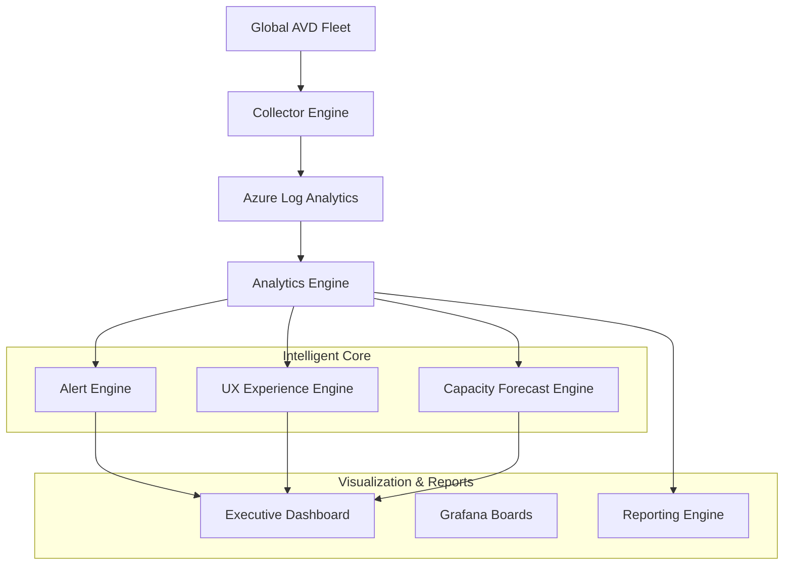
```mermaid
graph TD
    AVD[Global AVD Fleet] --> Collector[Collector Engine]
    Collector --> LAW[Azure Log Analytics]
    LAW --> Analytics[Analytics Engine]
    
    subgraph "Intelligent Core"
        Alert[Alert Engine]
        UX[UX Experience Engine]
        Capacity[Capacity Forecast Engine]
    end
    
    subgraph "Visualization & Reports"
        Portal[Executive Dashboard]
        Grafana[Grafana Boards]
        Reports[Reporting Engine]
    end
    
    Analytics --> Alert
    Analytics --> UX
    Analytics --> Capacity
    Alert --> Portal
    UX --> Portal
    Capacity --> Portal
    Analytics --> Reports
```

### 2. The Observability Lifecycle Flow (Collection & Analysis)
The continuous path of a telemetry stream from session host event capture and normalization to real-time Kusto query wakes and live host pulses. This ensures zero-interruption operations through dependency-aware monitoring flows.

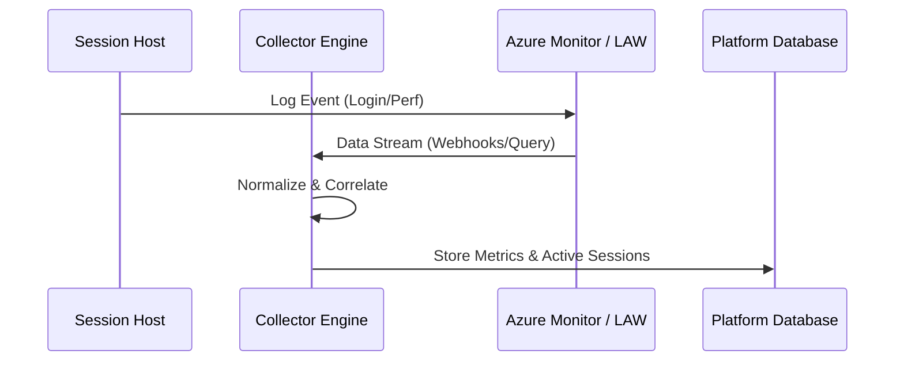
```mermaid
sequenceDiagram
    participant VM as Session Host
    participant Coll as Collector Engine
    participant Azure as Azure Monitor / LAW
    participant DB as Platform Database

    VM->>Azure: Log Event (Login/Perf)
    Azure->>Coll: Data Stream (Webhooks/Query)
    Coll->>Coll: Normalize & Correlate
    Coll->>DB: Store Metrics & Active Sessions
```

**Real-time Monitoring Flow:**
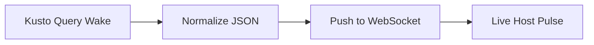
```mermaid
graph LR
    Hook[Kusto Query Wake] --> Process[Normalize JSON]
    Process --> Update[Push to WebSocket]
    Update --> UI[Live Host Pulse]
```

### 3. Distributed Observability Topology (Global Hub & LAW Shards)
Strategically orchestrating standardized observability across global regions (EMEA, US, APAC) and diverse resource shards, providing a unified institutional view of desktop health.

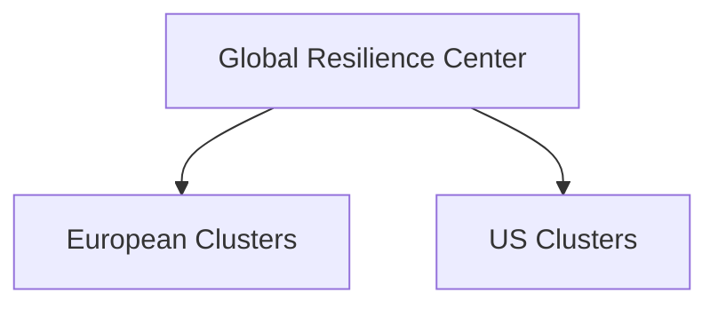
```mermaid
graph TD
    Global[Global Resilience Center]
    Global --> Cluster1[European Clusters]
    Global --> Cluster2[US Clusters]
```

**Global Monitoring Topology:**
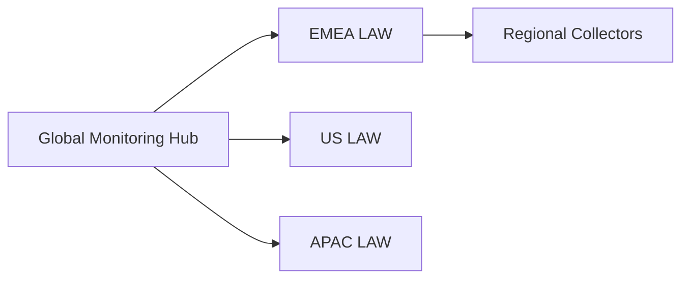
```mermaid
graph LR
    Hub[Global Monitoring Hub] --> Region1[EMEA LAW]
    Hub --> Region2[US LAW]
    Hub --> Region3[APAC LAW]
    Region1 --> Agents[Regional Collectors]
```

### 4. Governance Hub & Control Plane Flow
Executing complex logic for securing the bridge between telemetry streams and operational boards, ensuring every alert is authorized, capacity is forecasted, and executive oversight is maintained.

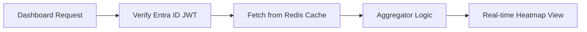
```mermaid
graph LR
    User[Dashboard Request] --> Auth[Verify Entra ID JWT]
    Auth --> Cache[Fetch from Redis Cache]
    Cache --> Logic[Aggregator Logic]
    Logic --> View[Real-time Heatmap View]
```

**Capacity Forecast Workflow:**
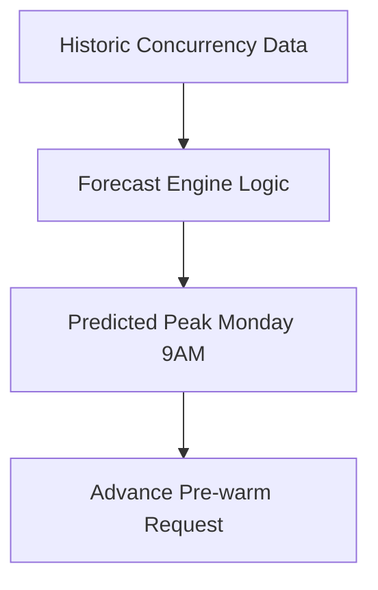
```mermaid
graph TD
    History[Historic Concurrency Data] --> ML[Forecast Engine Logic]
    ML --> Prediction[Predicted Peak Monday 9AM]
    Prediction --> Recruit[Advance Pre-warm Request]
```

**Executive Governance Workflow:**
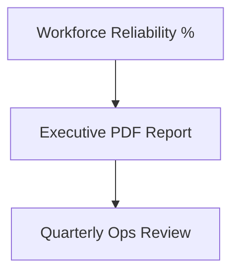
```mermaid
graph TD
    Stat[Workforce Reliability %] --> Board[Executive PDF Report]
    Board --> Review[Quarterly Ops Review]
```

### 5. Multi-Cloud Observability Federation & Global Topology
Automatically managing unified health standards across diverse cloud tenants and global regions, ensuring institutional data residency and privacy boundaries by default.

### 6. Encryption & Perimeter Protection Flow (Security Trust Boundary)
Managing the lifecycle of a telemetry request, automatically enforcing institutional PII masking and RBAC standards as required by security policy, ensuring zero-latency security confidence.

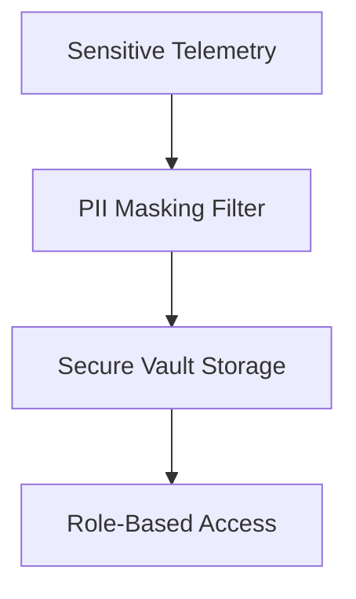
```mermaid
graph TD
    Logs[Sensitive Telemetry] --> PII[PII Masking Filter]
    PII --> Secure[Secure Vault Storage]
    Secure --> RBAC[Role-Based Access]
```

### 7. Institutional Observability Maturity Scorecard (SLA Reporting)
Grading organizational performance based on key indicators: UX Experience Scores, Login Success Ratios, and SLA Compliance Scores.

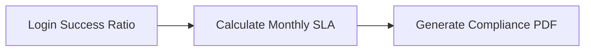
```mermaid
graph LR
    LoginRatio[Login Success Ratio] --> SLA[Calculate Monthly SLA]
    SLA --> Export[Generate Compliance PDF]
```

**UX Analytics Flow:**
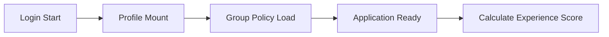
```mermaid
graph LR
    Login[Login Start] --> Profile[Profile Mount]
    Profile --> Group[Group Policy Load]
    Group --> App[Application Ready]
    App --> UXScore[Calculate Experience Score]
```

**FSLogix Latency Workflow:**
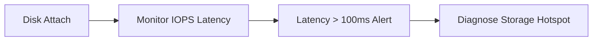
```mermaid
graph LR
    Mount[Disk Attach] --> IOPS[Monitor IOPS Latency]
    IOPS --> Alert[Latency > 100ms Alert]
    Alert --> Diagnose[Diagnose Storage Hotspot]
```

### 8. Identity & RBAC for Observability Governance
Managing fine-grained access to monitoring hubs, provisioning workers, and audit logs between Global Managing Organizations and Sector divisions.

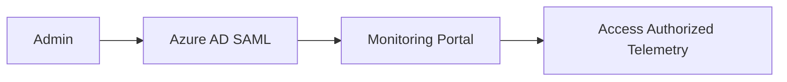
```mermaid
graph LR
    User[Admin] --> SAML[Azure AD SAML]
    SAML --> Portal[Monitoring Portal]
    Portal --> Metrics[Access Authorized Telemetry]
```

**Multi-Tenant Tenancy Model:**
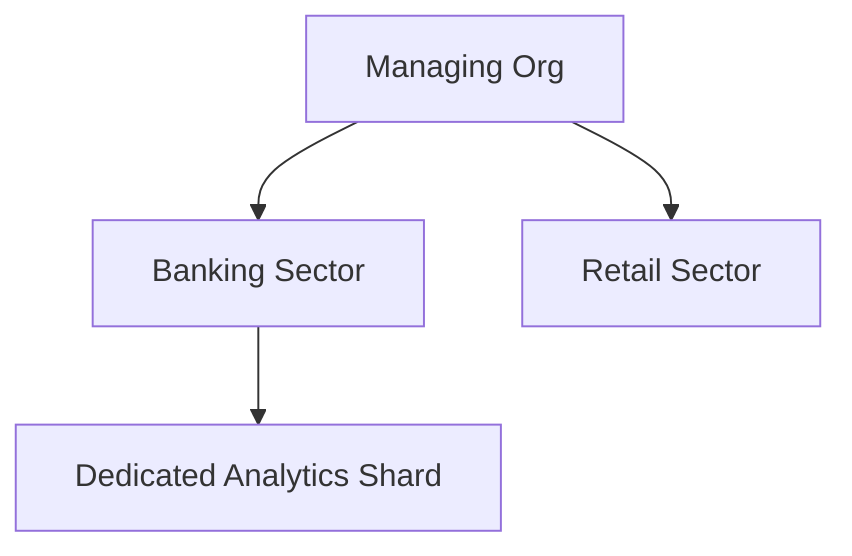
```mermaid
graph TD
    Root[Managing Org]
    Root --> Div1[Banking Sector]
    Root --> Div2[Retail Sector]
    Div1 --> Shard[Dedicated Analytics Shard]
```

### 9. IaC Deployment: AVD-Monitoring-Pack-as-Code Framework
Using modular CI/CD pipelines to deploy and manage the versioned distribution of the alert rules, collector containers, and validation fleets.

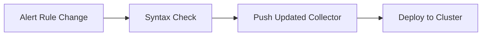
```mermaid
graph LR
    Rules[Alert Rule Change] --> Test[Syntax Check]
    Test --> ACR[Push Updated Collector]
    ACR --> AKS[Deploy to Cluster]
```

### 10. AIOps Observability Drift & Risk Validation Flow
Using advanced analytics to identify sudden surges in session host failures, unauthorized health changes, or unusual delivery pattern changes that could result in institutional risk or downtime.

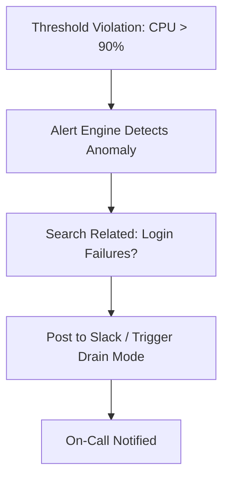
```mermaid
graph TD
    Issue[Threshold Violation: CPU > 90%] --> Trigger[Alert Engine Detects Anomaly]
    Trigger --> Correlate[Search Related: Login Failures?]
    Correlate --> Action[Post to Slack / Trigger Drain Mode]
    Action --> Notify[On-Call Notified]
```

**Noise Reduction Correlation Flow:**
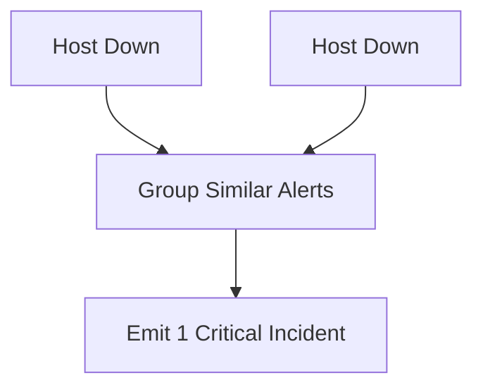
```mermaid
graph TD
    Alert1[Host Down] --> Group[Group Similar Alerts]
    Alert2[Host Down] --> Group
    Group --> Single[Emit 1 Critical Incident]
```

**Auto-Remediation Workflow:**
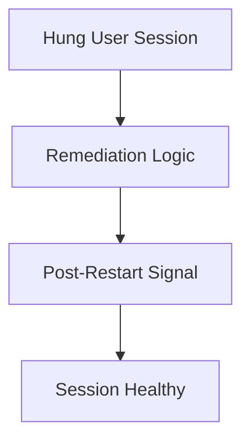
```mermaid
graph TD
    Hang[Hung User Session] --> Engine[Remediation Logic]
    Engine --> Script[Post-Restart Signal]
    Script --> Recover[Session Healthy]
```

**Disaster Recovery Topology:**
```mermaid
graph TD
    Primary[UK South Monitor Hub] --> Geo-Replicated Database]
    Geo --> Secondary[US East 2 Standby Hub]
    Primary -.->|Outage| Switch[Failover to Secondary]
```

### 11. Metadata Lake for Forensic Observability Audit
Storing long-term records of every health integration event (metadata), every cost analytics cycle, and every executive report for institutional record-keeping and forensic analysis.

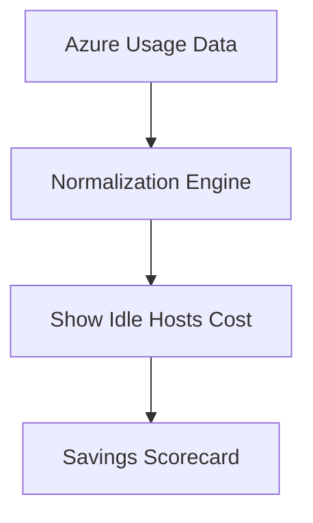
```mermaid
graph TD
    Billing[Azure Usage Data] --> Normal[Normalization Engine]
    Normal --> Rightsizing[Show Idle Hosts Cost]
    Rightsizing --> Report[Savings Scorecard]
```

---

## 🏛️ Core Governance Pillars

1.  **Unified Foundation Coordination**: Maximizing resilience by centralizing all health measurement through a single institutional plane.
2.  **Automated Health Provisioning**: Eliminating "manual tracking" scenarios through proactive orchestration and pattern verification.
3.  **Sequential Observability Intelligence**: Ensuring zero-interruption operations through dependency-aware monitoring-driven data engineering.
4.  **Zero-Trust Identity Protection**: Automatically enforcing identity-based access, PII encryption, and policy evaluation across all assurance tiers.
5.  **Autonomous Operations Logic**: Guaranteeing reliability through automated industry-specific effectiveness monitoring runbooks.
6.  **Full Observability Auditability**: Immutable recording of every health change and observability provision for institutional forensics.

---

## 🛠️ Technical Stack & Implementation

### Observability Engine & APIs
*   **Framework**: Python 3.11+ / FastAPI.
*   **Performance Engine**: Custom Python-based logic for multi-cloud health reconciliation and DORA-style EUC metrics.
*   **Integrations**: Native connectors for Azure Monitor, Log Analytics, and FSLogix performance counters.
*   **Persistence**: PostgreSQL (Observability Ledger) and Redis (Live Health State).
*   **Auth Orchestrator**: Federated OIDC/SAML for least-privilege observability management access.

### Governance Dashboard (UI)
*   **Framework**: React 18 / Vite.
*   **Theme**: Dark, Slate, Indigo (Modern high-fidelity productivity aesthetic).
*   **Visualization**: D3.js for delivery topologies and Recharts for ROI velocity analytics.

### Infrastructure & DevOps
*   **Runtime**: AWS EKS or Azure Kubernetes Service (AKS) for management plane.
*   **Measurement Hub**: Managed event sourcing for immutable productivity timeline reconstruction.
*   **IaC**: Modular Terraform for deploying the observability landing zone and validation fleet.

---

## 🏗️ IaC Mapping (Module Structure)

| Module | Purpose | Real Services |
| :--- | :--- | :--- |
| **`infrastructure/observability_hub`** | Central management plane | EKS, PostgreSQL, Redis |
| **`infrastructure/enforcers`** | Distributed health provisioners | Azure, AWS, GCP APIs |
| **`infrastructure/observability_pipes`** | Data Ingestion Hubs | Webhooks, Lambda |
| **`infrastructure/auditing`** | Forensic modernization sinks | S3, Athena, Quicksight |

---

## 🚀 Deployment Guide

### Local Principal Environment
```bash
# Clone the AVD Monitoring Pack repository
git clone https://github.com/devopstrio/avd-monitoring-pack.git
cd avd-monitoring-pack

# Configure environment
cp .env.example .env

# Launch the Observability stack
make init

# Trigger a mock observability update and automated guardrail validation simulation
make simulate-monitoring
```

Access the Management Portal at `http://localhost:3000`.

---

## 📜 License
Distributed under the MIT License. See `LICENSE` for more information.

---
<div align="center">
  <p>© 2026 Devopstrio. All rights reserved.</p>
</div>
